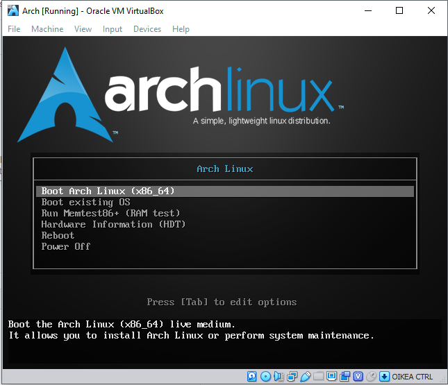

This is a re-write of my old Arch Linux installation notes. Originally they were just on different text files on my github repo and
they became too hard to read at some point so I decided to combine these notes to a proper blog post. The blog post was originally created
to my old wordpress website a couple of years ago. Decided I would migrate this to here as well.


## Requirements:
* Time and patience.  
* Virtual machine ( or why not a real machine ) 
* Arch Linux image 
* 1GB RAM
* 8GB free hard disk space

## Steps:
1. Install VirtualBox
2. Install Arch Linux
3. ???
4. Profit

Easy, huh? So lets begin by installing the virtual machine so we can actually launch the Arch Linux!


## Download:
* https://www.virtualbox.org/wiki/Downloads
* https://www.archlinux.org/download/


#### 1. VirtualBox setup
1. Click New
2. Select the 64-bit Arch Linux and select a machine folder
3. Allocate RAM for the virtual machine. Recommended 1024MB should be enough.
4. Create a virtual hard disk
5. Select hard disk file type: VDI
6. Set the storage as dynamically allocated so that it won’t reserve the whole space immediately.
7. Type the name for the Virtual disk and allocate the size.Recommended 8GB is just fine for messing around with virtual machine

Now the virtual machine has been setup and the virtual machine is ready to be started. 
Click Start, select 64-bit Arch Linux as a start-up disk and click Start. 

### Virtual machine setup notes:
* If you lose your mouse on VirtualBox, click **right Ctrl**
* You can scroll up/down the terminal window with **Shift + PageUp/PageDown**
* If you get stuck in scaled mode: click **right Ctrl + C**
* Exit full screen mode right **Ctrl + F**


## Now on to the sweet Arch Linux installation part.



#### 2. Starting Arch Linux virtual machine
2.1 Click Boot Arch Linux ( x86_64 ). After Linux boots up, you should be sitting at root@archiso shell.

2.2 ( Optional ) set the keyboardlayout temporarily to finnish. ( Or whatever your language is. Default is english ) 
```
loadkeys fi
```
2.3 Check the network connection by pinging a google server
```
ping google.com
```
2.4 **If your connection works**, skip to step 4.

#### 3. Setting up network connection

3.1 Check the ethernet card status and the drivers it uses. Command lists information about PCI buses and devices. Scroll up and search for Ethernet controller portion.
```
lspci -v
```
3.2 To search for Ethernet part, and print 10 lines after that:
```
lspci -v | grep -A 10 "Ethernet"
```


Kernel driver in use: e1000 – This is your card’s driver 

3.3 Now we can search for the driver in the kernel message buffer to see if it is up.
```
dmesg | grep e1000
```

Output should look something like this, when the card is up and running:


3.4 If the driver is not in use, we need to load the driver. replace [ e1000 ] with your driver shown in lspci.
```
rmmod e1000
modprobe e1000
```
Throw in another ping to google server to test the connection. I have successfully fixed my connection issues this way a few times whenever 
I have started a fresh Arch install. 

Of course there are many possible reasons why the connection is not working, especially wireless connection, 
but this is all that I have documented on my notes. If this doesn’t help, some googling is required to go forward I’m afraid.

#### 4. Setup disk partitions. 

4.1 Check the disk name:
```
fdisk -l
```


/dev/sda is the one here

4.2 Open the partitioning tool:
```
cgdisk /dev/sda
```

4.3 Create a boot partition:
```
- Press New
- Size -> 512M
- Code -> EF00
- Name -> boot
```

4.4 Create a swap partition:
```
- Press New
- Size -> 512M
- Code -> 8200
- Name -> swap
```

4.5 Create a root partition:
```
- Press New
- Size -> 5G
- Code -> 8300
- Name -> root
```

4.6 Create a home partition:
```
- Press New
- Size -> Enter ( Uses rest of the space. )
- Code -> 8300
- Name -> home
```

4.7 At this point the partitioning is done and just needs to be written to the disk:
```
- Press Write -> Yes.
```

4.8 Check that the partition table got written to the disk correctly:
```
lsblk
```


Partition table should look something like this.

4.9 Format the partitions

Create boot:
```
mkfs.fat -F32 /dev/sda1
```

Create swap:
```
mkswap /dev/sda2
```

Turn swap on:
```
swapon /dev/sda2
```

Create root partition:
```
mkfs.ext4 /dev/sda3
```

Create home partition:
```
mkfs.ext4 /dev/sda4
```

Create /mnt directory:
```
mkdir /mnt
```

Mount root to /mnt:
```
mount /dev/sda3 /mnt
```

Create boot directory:
```
mkdir /mnt/boot
```

Create home directory:
```
mkdir /mnt/home
```

Create home directory:
```
mkdir /mnt/home
```

Mount sda1 to boot directory:
```
mount /dev/sda1 /mnt/boot
```

Mount sda4 to home directory:
```
mount /dev/sda4 /mnt/home
```

#### 4. System setup. 
5.1 Install the system:
```
pacstrap -i /mnt base base-devel
```
Press enter to all of the questions ( to install all packages )

5.2 Generate fstab file:
```
genfstab -U -p /mnt >> /mnt/etc/fstab
```
Fstab-file can be used to define what disks / partitions are going to be mounted to the filesystem.

5.3 Check that the 4 newly created partitions exists in fstab-file:
```
nano /mnt/etc/fstab
```


Fstab should look something like this.

5.4 Chroot to /mnt.
```
arch-chroot /mnt
```

5.5 Generate locale files:
```
nano /etc/locale.gen
```
Uncomment en_US-UTF-8:

##### ProTip: Press Ctrl + W and search for “en_US” 

5.6 Generate files:
```
locale-gen
```

5.7 Setup language:

Create locale.conf and put en_US.UTF as default language
```
echo LANG=en_US.UTF-8 > /etc/locale.conf
```

Export language:
```
export LANG=en_US.UTF-8
```

5.8. Setup time

Set the timezone:
```
ln -s /usr/share/zoneinfo/Europe/Helsinki /etc/localtime
```

Setup hardware clock:
```
hwclock --systohc --utc
```

5.9 Setup package manager:
```
nano /etc/pacman.conf
```
* Uncomment [multilib] and Include below it
* Add to the end of the file:
```
[archlinuxfr]
SigLevel = Never
Server = http://repo.archlinux.fr/$arch
```


Pacman.conf should look something like this.

5.10 Update the system.
```
pacman -Syu
```

5.11 Setup users and passwords.

Set the hostname and password:
```
echo [YOUR_HOSTNAME_HERE] > /etc/hostname
passwd [YOUR_HOSTNAME_HERE]
```

Add the new user to group ‘wheel’:
```
useradd -m -g users -G wheel -s /bin/bash [YOUR_HOSTNAME_HERE]
```

Enable sudo for user:
```
EDITOR=nano visudo
```
Remove #-sign from #%wheel ALL=(ALL) ALL


Visudo should look something like this.

Setup root password:
```
passwd
```

5.12 **( Optional )** Skip if you are not booting in EFI-mode. ( If you followed the VirtualBox tutorial, skip this part. )

Check that EFI variables are mounted:
```
mount -t efivarfs efivarfs /sys/firmware/efi/efivars
```

Install EFI to boot:
```
bootctl --path=/boot install
```

5.13 Configure bootloader:

Create a folder for conf file:
```
mkdir -p /boot/loader/entries/
```
**[ -p ] -tag creates folders recursively**

Open and create a conf file:
```
nano /boot/loader/entries/arch.conf
```
* Type to the file:

```
title Arch Linux
linux /vmlinuz-linux
initrd /intel-ucode.img      # ( if PC has an Intel CPU )
initrd /initramfs-linux.img
options root=/dev/sda3 rw
```


Bootloader configuration file should look something like this.

5.14 Setup bootloader.

##### ( Optional ) Install intel microcodes if you have Intel CPU:
```
pacman -S intel-ucode
```

Install bootloader:
```
pacman -S grub-bios
```

##### ( Optional ) If bootloader installing fails and you have booted in EFI mode:
```
pacman -Sy efibootmgr
grub-install --target=x86_64-efi --efi-directory=/boot --bootloader-id=grub --recheck
```

Install bootloader to harddrive:
```
grub-install /dev/sda
```

##Note!
Here I actually got my first error:
```
grub-install: warning: this GPT partition label contains no BIOS Boot Partition; embedding won’t be possible.
Grub-install: warning: Embedding is not possible. GRUB can only be installed in this setup by using blocklists. However, blockists are UNRELIABLE and their use is discouraged..
grub-install: error: will not proceed with blocklists.
```
I solved it by adding --force to the command so that it will use the blocklists. Kind of an ugly way to solve a problem and I might come back to the article and update a proper way to fix this.
```
grub-install --force --target=i386-pc /dev/sda
```

Create a init ramdisk file for temporary root file system during startup:
```
mkinitcpio -p linux
```

Create a grub config-file:
```
grub-mkconfig -o /boot/grub/grub.cfg
```

Exit chroot:
```
exit
```

Unmount the drive:
```
umount /mnt/boot
umount /mnt/home
umount /mnt
```

Reboot the system:
```
reboot
```

5.15 Boot up the system

Open the bootloader from the menu:
```
- Choose 'Boot existing OS' from the menu
- Select Arch Linux
```


Arch Linux boot menu


GRUB bootloader


You should be sitting at login prompt.


Login with the username and password that you configured earlier. And once you log in, you can see that there is not much going on, just a black terminal window. Now we just need to install a GUI. 

## Congratulations! You have just installed Arch Linux!

At this point some more steps are going to be needed so that the Arch Linux build would be useful for anything, like installing sound and graphical user interface.
( Coming later.. )