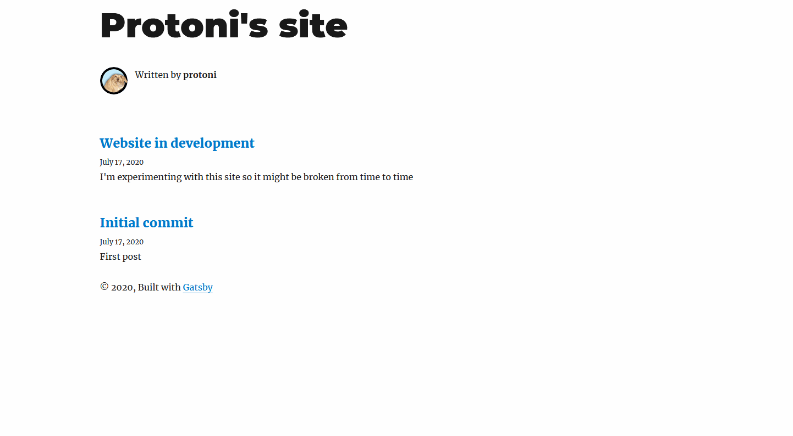
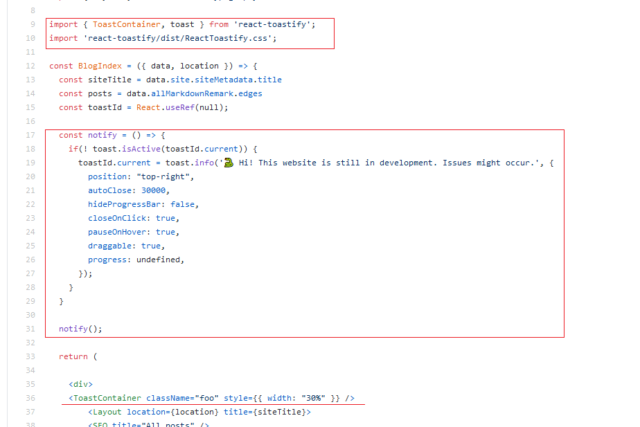

I'm experimenting with this site so it might be broken from time to time. 
I added an notification to the index page to indicate that, it will popup every time the page is loaded.

Decided to make a post about that too to get some content to the empty home page.

Tried a bunch of different notification React packages but couldn't get them to work the way I wanted.
I also did my own notification component to refresh my memory on how this react and javascript stuff works 
but that came out as pretty shite.
 
Gladly I finally found one that worked and was easy to implement, **react-toastify**.
The notification doesn't really look good on mobile at the moment tho.

Did this with a few lines of code:

Links:
* https://www.npmjs.com/package/react-toastify
