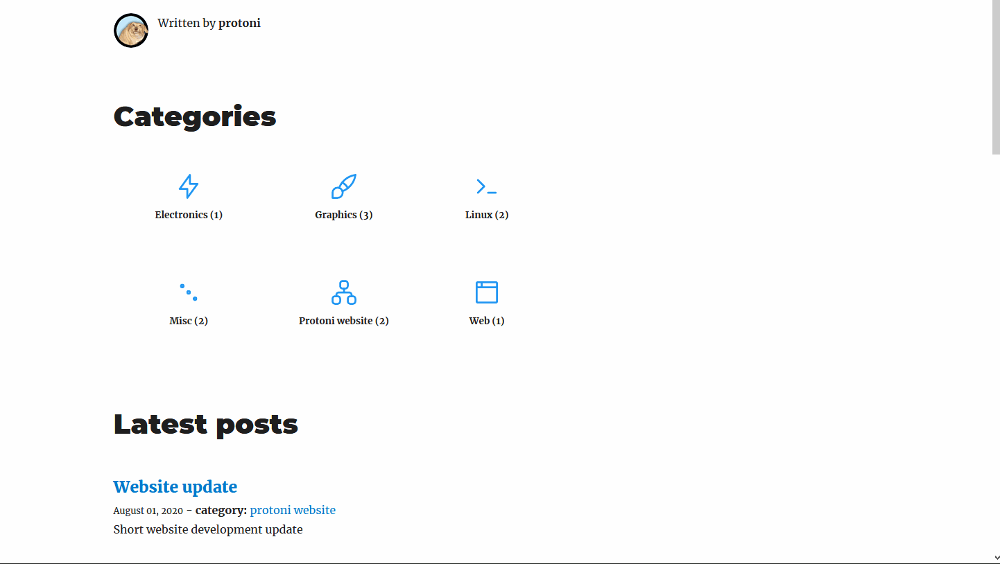
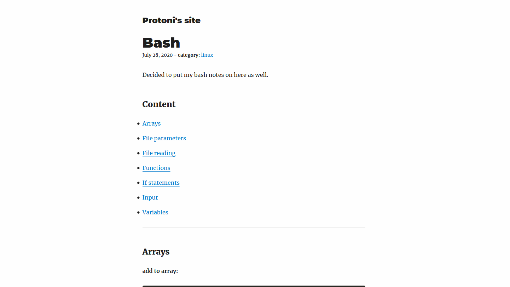
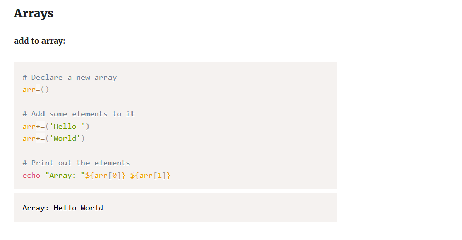
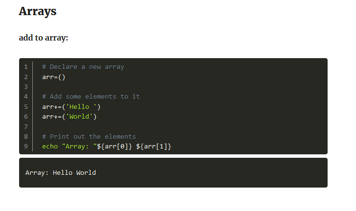
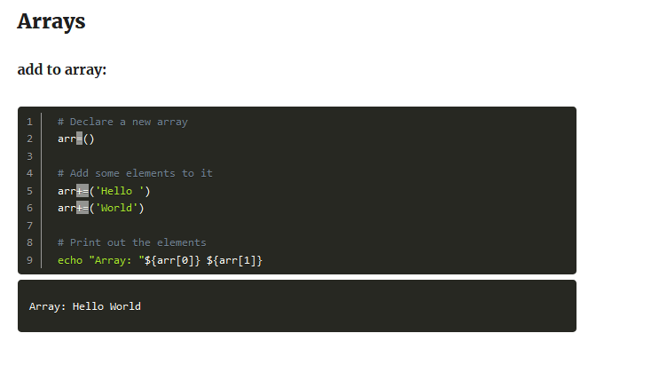
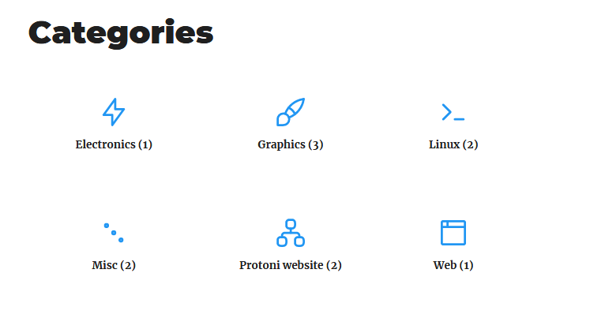

A short update on what I have been working on with this site.

### Table of contents:
- [Back to top button](#back-to-top-button)
- [Anchor links](#anchor-links)
- [Code blocks](#code-blocks)
- [Categories](#categories)
- [Links](#links)

### Back to top button
It got old pretty fast to have to scroll back up every time I reached the bottom of 
the bage so I added this little icon to the bottom right corner to help with this issue.

I tried some npm packages at first which would do this but they seemed overly complex for what the component actually does.

I was googling around what would be the best way to implement this. I ran into this issue on github and in the comments a 
user shared his implementation so I decided to use that as well, seems to work pretty well and the implementation seems clean.

- https://github.com/v4iv/gatsby-starter-business/issues/23
- https://publiuslogic.com/

I pretty much only had to change some css to adjust the position a bit. The React component had a props to adjust position but they didn't work
for me for some reason, so I just changed the css.

### Anchor links
I really like the scrolling **table of contents**-component gatsbyjs.org docs has: https://www.gatsbyjs.org/docs/quick-start/.

It it seemed like it would take some time to implement that sort of functionality so I decided to just use anchor links.
I used **gatsby-remark-autolink-headers**-gatsby plugin to achieve this. It works well and it is easy to setup the links on posts page.

Added **skip to content** -links functionality for the website.

Simple to use:

I had a problem with the links at first and I spent like 3 hours figuring that one out. I got the links setup right away and
they actually did something as well, but they didn't still work. When I clicked one of the links, it did add the anchor to the URL bar (#-tag)
but it wouldn't actually move to that location on the page.

Turns out I had added **gatsby-transformer-remark** twice in my **gatsby-config.js** and that messed it up somehow. There was also no warning or anything
when building the site so I kind of accidentally found the issue.

### Code blocks
I decided to modify the default code blocks a bit. Changed the color theme and added line numbers. Also the default one seemed to expand infinitely if enough
code was added to it so I added a max height for it and a scroll bar.

Default code blocks:

Changed to :

As always, I had some problems setting this thing up.

The code block would do this annoying highlight on equal and plus signs:

And another issue was that when I deployed the website, the theme would not work and the published website would just show the default theme.

A while of head scratching and googling resulted in me realizing that the **gatsby-browser.js** had the default prism.css theme imported at the same time
with this new one so it caused the highlighting issue. 

Decided to publish a fix and I found out that the theme did not work on published website because of this same issue. So both of these things got resolved
at the same time.

I of course also decided to download the theme css, save it to the project folder and modify it to my liking.

### Categories
Browsing content on the website felt a bit awkward so I decided to add categories to the front page.
I use the tags on the markdown file frontmatter to act as categories for now. 
I will probably change this in the future so that the markdown frontmatter would have tags and categories though. 

I'm not sure what would be the best way to structure the content on this site so I'm trying to categorize the content a bit.
I'll probably create these short updates on some projects and I guess it would be good to have it's own gategory at that point so that
the updates can be found and it would be easier to follow one specific project.

Categories on the front page:

### Links:
- https://github.com/v4iv/gatsby-starter-business/issues/23
- https://publiuslogic.com/
- https://www.gatsbyjs.org/docs/quick-start/