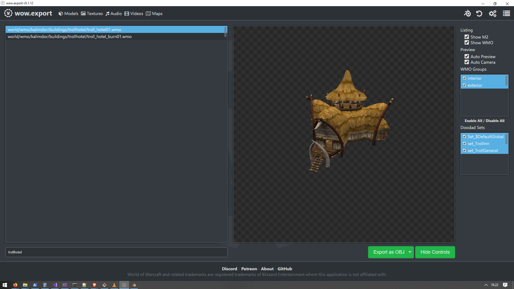
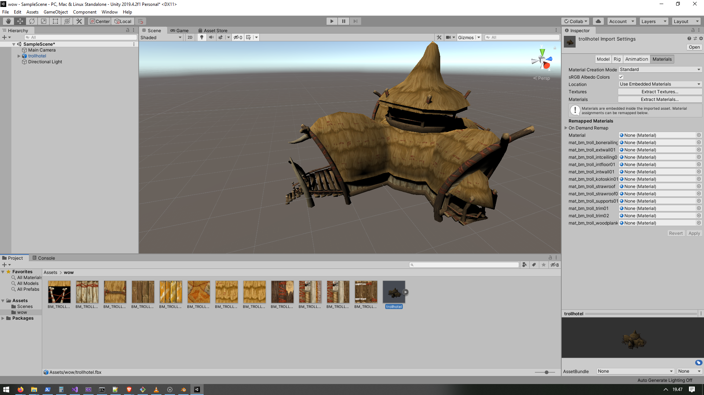
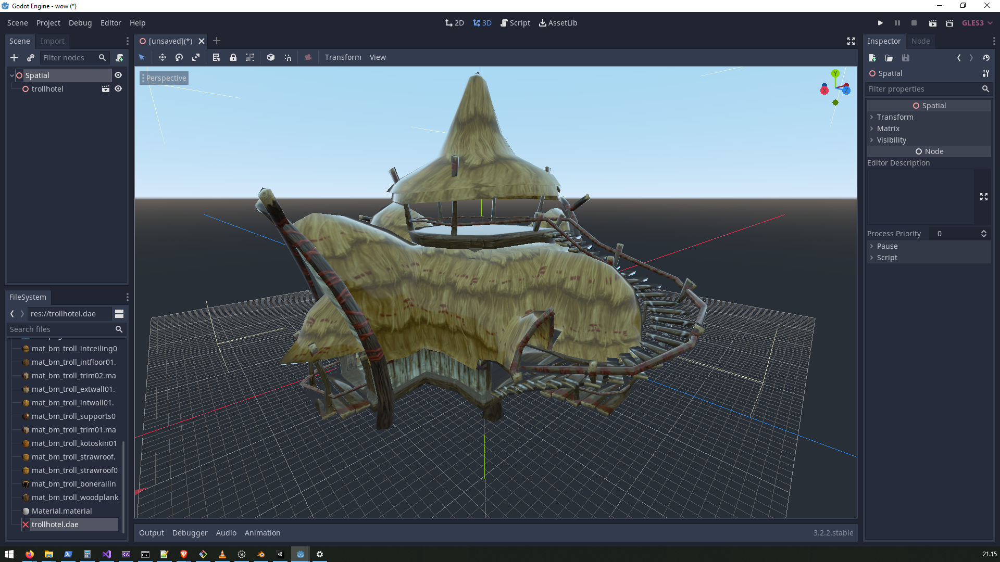

It's pretty easy to export models from WoW classic or retail version using this **WoW Export** -tool. 
There is also another tool for this called **Wow Model Viewer**, but I haven't used it much.

Building model imported to Blender

### Setup wow exporter
1. Go to https://wow.tools/export/
2. **Download** the exporter tool
3. **Extract** the zip file
4. Open the folder and run **wow.exporter.exe**
5. Slecet **Local Installation**. Select **\_classic_** or **\_retail_** from BattleNet installation folder
6. Click **Settings icon** in the top right corner.
7. Set your **Export Directory** and **Apply**
8. Click the **Blender icon** in the top right corner.
9. Click **Install Automatically**
10. Click **Go back**
11. Search for example **trollhotel.wmo**. The model has a preview next to it which supports zooming and moving the object.
12. Select all the **Doodads** on the right
13. Click **Export as OBJ**

### Import model to Blender
1. **File** -> **Import** -> **Wavefront (.obj)**
2. Browse to your **model export directory**
3. Select for example the **troll_hotel01.obj** and ** Import OBJ**
4. To view textures, click **Viewport Shading** button in the top right corner. ( Round icon )

### Import model to Unity
Textures need to be embedded to the model and I found that it is best done using blender
1. Create a new 3D Unity Project
2. Open Blender and click **File** -> **export** -> **FBX (.fbx)**
3. From **Path Mode** section on the right, select **copy** and **select the box next to it**

4. Navigate to **Unity project folder/Assets**. Create new folder, for example **WoW**, name the model file and click **Export FBX**
5. In **Unity**, from **Project** window, open **Assets/wow/**
6. Select **trollhotel** model.
7. From the **Inspector** window on the right, Select **Materials**.
    * **Material Creation Mode** : Standard
    * **sRGB Albedo Colors**     : Selected
    * **Location**               : Use Embedded Materials**
8. Click **Extract Textures..**
9. Select the **Assets/wow/** folder.
10. **Drag** the **trollhotel** model to the viewport
11. Model is now imported and textures should work.

### Import model to Godot #1
1. Create a **new Godot project**
2. From **Blender**, click **File** -> **Export** -> **Collada(default)(.dae)**
3. Browse to **Godot folder**, create folder **Assets**, name the model to **trollhotel.dae** and click **Export COLLADA**
4. Open **Godot**
5. Create a **Scene**: **Scene** -> **3D Scene**
6. Go to **FileSystem** and drag the **trollhotel.dae** to the viewport

For me this method created a weird glossy effect for the whole object in Godot. Didn't really spend too much time trying to fix it. I found out that there is
another way to import objects from Blender to Godot, see **Import model to Godot #2**.

### Import model to Godot #2
1. Install **Godot Blender Exporter**: https://github.com/godotengine/godot-blender-exporter
2. **Copy** the **io\_scene\_godot -directory** the location where **Blender stores the scripts/addons** folder on your system 
(you should see other io_scene_* folders there from other addons). Copy the entire dir and not just its contents.
3. Go to the Blender settings **Edit** -> **Preferences** -> **Add-ons** and **enable** the **Godot Engine Exporter** plugin.
4. Export your file with **File** -> **Export** -> **Godot Engine (.escn)**
5. **Note** that the exported files needs to be **saved** to **Godot project folder**

Model compared to the **Import model to Godot #1** method. Lighting seems to be turned way up in the godot engine exporter one, but the gloss effect is gone.

### Custom OpenGL renderer
Got the model also working in my custom OpenGL renderer. All the doodads ( decorations and such ) are also loading properly. Transparent objects needs some work still
as you can see they have a black background. See my [OpenGL experiments](/opengl-experiments) post

Links:
* https://wow.tools/export/
* https://www.blender.org/
* https://unity.com/
* https://www.blender.org/
* https://wowmodelviewer.net/new/
* https://www.youtube.com/watch?v=ybcq2C93i2k
* https://github.com/godotengine/godot-blender-exporter